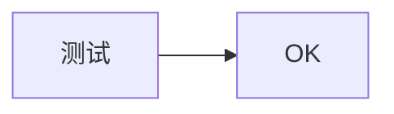
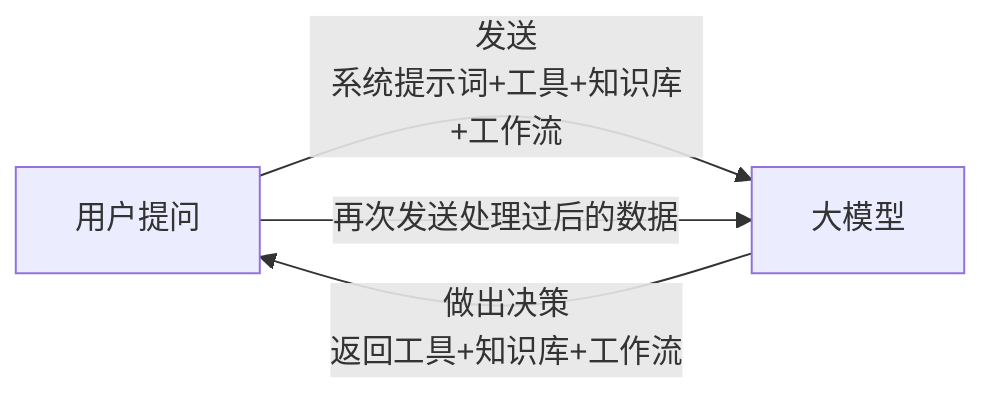

Agent是什么，简单一点来说，就是一个可以和大模型聊天，并且通过聊天的方式和设定的规则进行处理问题的软件，一个好用的agent基本都包含以下特点，设计简单，容错性高，处理问题快，处理问题准确。因为agent基本都是通过api和大模型聊天，要么是http或者流式http，通过和大模型进行多轮对话，获取想要的答案或者执行相应的任务。

### Agent主要以下几大组件

1. 提示词规则 ( prompt rules )
2. 工具方法 ( functionCall )
3. 知识库 （ RAG ）
4. 工作流 ( workflow )
5. 上下文问 （ context ）
6. 记忆系统 （ Mermory ）

一般的设计流程图如下






以上就是一个agent的完成执行过程，它会不断的重复一下操作，直到获取到结果或者没有结果，返回给用户

#### 设计一个agent要注意的问题

1. http 请求 需要做超时以及其他的异常处理
2. 需要合理的压缩提示词
3. agent 需要责任链分工
4. 需要对每次会话做总结汇总
5. 需要对执行过程进行日志或者镜像记录
6. 需要用简洁的语言描述工具的调用
7. 必须要做好权限


### 目前Agent的形态

1. 本地agent(比较流行的使用)

  - openClaw
  - hermes 
  - Codex
  - claude Code
  - deepseek harness
  - ...

2. 线上agent
  
  - 现在看到通过网页提问
  - 还有就是通过提问

### agent 开发的编程语言(理论上任何语言都可以)

1. nodeJs(Typescript)

   -- openclaw 
   -- deepseek harness
   -- 以及很多 cli

2. python

  - hermes
  - langchain 以及 langGraph

3. java

  - agentScope
  - langchain4j
  - spring-AI


### 一般的agent项目架构

```
  Agent/
  |--llam-provider(模型提供商)
  |--llam-client(http)
  |--llam-router(模型编排)
  |--llam-memory(记忆系统)
  |--llam-mcp(外部mcp)
  |--llam-skills(skills)
  |--llam-tools(工具调用)
  |--llam-session(会话管理)
  |--llam-permisson(权限管理)
  |--llam-log(日志和镜像)
  |--llam-exception(异常处理)

```
具体实现可以通过以结构直接让AI生成

### 一般agent系统出现得问题

1. 提示词不明确，调用模型出入过多提示词很慢
2. 模型没有按照需要返回正确的格式
3. 识别不准，调错函数，或者输错的答案
4. 多轮对话出现幻觉问题，无法连接上下文
5. 多轮对话上下文过长，导致请求变慢和幻觉


### 处理办法

1. 提示词通过AI自己编写
2. 做好错误处理，如果格式错误，需要重试
3. 更换模型或者重试
4. 对上下文进行总结之后再发送，如果总结之后还是过长，需要提取关键的信息

